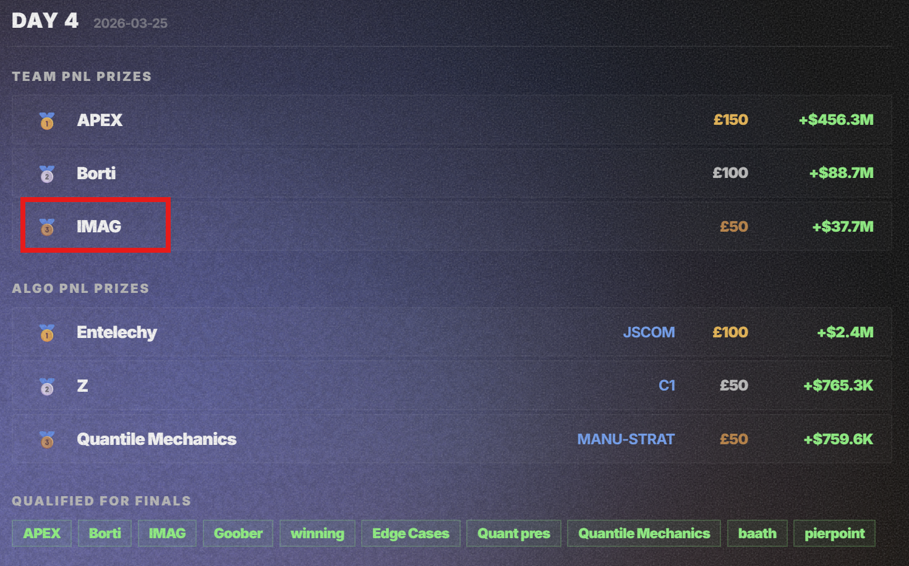
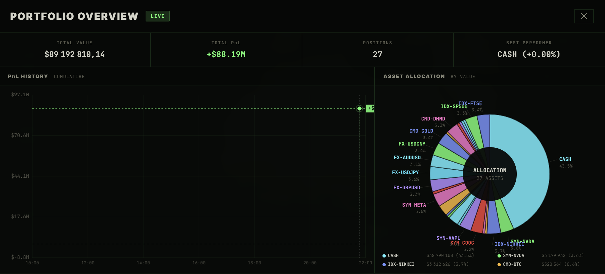

# QuantiHack 2026: from a cheated trading bot to a solar-storm research paper

> Team **IMAG** · Imperial College London · March 2026

[QuantiHack](https://quantihack.com/info) was billed as the UK's largest quant event: a week-long online trading competition (22-27 March 2026, **853 players in 232 teams**) followed by an in-person final in London on 28 March. It was sponsored by **Anthropic** (gold), **Jane Street** and **Optiver** (silver).

I took part with **Sara Bazouane** ([@bazouanes-ICL-Ensimag](https://github.com/bazouanes-ICL-Ensimag)), another Ensimag exchange student at Imperial College London in 2025-26. *IMAG is the nickname of Ensimag, our engineering school.* We competed against teams from the best UK universities, Oxford and Cambridge included.

**What happened**

- **Qualification (online, 5 days):** each day, the 10 teams with the best PnL qualified for the in-person final. We finished in the top 10 on **3 of the 5 days**, including **3rd place on Day 4** (+$37.7M PnL that day, in simulated dollars, see [Results](#results)), which got us to the final.
- **Final (in person):** [Encode Hub](https://hub.encodeclub.com/), 41 Pitfield Street, London N1 6DA. We wrote a research paper, *Data Alchemy*, on whether solar geomagnetic activity carries any information about markets. Spoiler: the results were mostly negative.

This repository is a write-up of our participation, plus the final paper as a PDF. It contains no trading code: the strategy was so simple that the code would have little interest. The whole thing came down to finding the API and refreshing the tokens from the browser dev tools.

**Contents:** [Part 1: qualification phase](#part-1-qualification-phase) · [Part 2: in-person final](#part-2-in-person-final) · [Repository layout](#repository-layout)

---

## Part 1: Qualification phase

### The setup

Teams traded on a simulated exchange through the organisers' web platform. The platform offered a code editor, assisted by Claude, to write trading bots and launch them on 26 instruments: 8 synthetic stocks (`SYN-*`), 5 FX pairs (`FX-*`), 9 commodities and crypto (`CMD-*`) and 3 indices (`IDX-*`). Each day, teams were ranked by PnL.

### The problem: a platform under load

The platform was often unstable: saturated order books, algorithms that would not start, orders frozen or never sent. That is not surprising. Around 850 players were hitting an infrastructure that a few student organisers (Cambridge students) were running on their own. It is a hard job, but it meant that our time went into fighting the platform rather than into strategy.

### The pivot (Day 3): skip the UI

On Day 3 we chose an unconventional route, and after all it is a *hack*athon. Two observations drove it:

1. The **simulated market data followed regular, periodic patterns**. A simple rule could exploit that, so a sophisticated strategy was not needed.
2. The **platform was the bottleneck**, not the strategy.

So we stopped using the platform to run bots. Instead we watched the network requests the web app sends when trading manually (browser dev tools, Network tab) and identified the HTTP API behind it: the order and portfolio endpoints. Then we wrote our own Python bots that talk to that API directly, with our team's own credentials.

While other teams had orders that were frozen or impossible to send, ours went through smoothly. Most of the remaining work was operational: **the authorisation tokens were short-lived**, so we had to capture them manually from the browser dev tools and paste them into the `Authorization: Bearer ...` header of our bots.

The strategy itself was deliberately simple: **buy all the time, sell at a small profit**, relying on the periodic patterns. It took us **from around 20th to 4th place in under an hour**, late on Day 3, when progress was otherwise hard to come by. In short, a cheated strategy, and we call it that ourselves.

### What the bots did

A fleet of small Python processes, one buyer and one seller per instrument (52 in total), plus a supervisor:

- **Buyers** kept each instrument near a target share of total capital (initially 1/26) and bought when the position was under target.
- **Sellers** sold a position at a small take-profit, or on a -10% stop-loss.
- **A supervisor** reweighted the 26 targets every 10 seconds from recent PnL, so capital drifted toward what was working.

That is the whole "strategy": simple rules, a lot of parallel processes, and a direct line to the API.

#### Market orders, and why the bots checked the price first

The platform offered two kinds of orders: **limit** and **market**. Our bots used **market orders**, to be as fast as possible in that chaos.

The catch is that when the platform froze, the market order book sometimes emptied out, and some participants posted aberrant limit prices far below the market to buy. In that situation, selling at market could mean selling for next to nothing.

So before acting, each bot sent a tiny market order (0.0001 unit) just to answer one question: *what is the real market price right now?* Buyers used it to avoid paying too much, and sellers to avoid dumping a position into a broken order book.

### Results

Every day started from $1M of simulated capital, and we multiplied it by 126 or more within a single day (hence the non-realistic market environment, and the patterns identified that could lead to infinite money).

Team PnL ranking for **Day 4** (25 March 2026): we finished 3rd, and IMAG appears in the list of teams qualified for the final.



Portfolio overview from the platform: 26 instruments, each held at roughly 3-4% of the portfolio, with 43.5% left in cash (total value $89.19M, total PnL +$88.19M).



### Caveats

- **Not in the spirit of the platform.** We bypassed the intended interface. We only used the same API the web app calls, only with our own team's token, and only to place our own orders. That is why we call it a cheated strategy.
- **The engineering was crude.** Checking the price with real (tiny) orders, roughly every second per bot, worked but added load to a platform that was already struggling. It was fine for a hack; I would design it differently today.

What I take from it: the exercise was as much about **operations under failure** (keeping 52 processes alive, refreshing credentials, reallocating capital live) as about trading.

---

## Part 2: In-person final

The final was an all-day hackathon at [Encode Hub](https://hub.encodeclub.com/) in London on 28 March. Themes were proposed and the format was free. According to the event page, scoring combined bounty challenges (40%) and a presentation to a jury (60%).

We chose to write a **research paper** rather than a demo: *Data Alchemy: Extracting Financial Relevance through the Lens of Solar Geomagnetic Activity* ([`report.pdf`](report.pdf)).

- **Question:** could an unconventional external factor, geomagnetic activity (the Kp and ap indices from [GFZ Potsdam](https://www-app3.gfz-potsdam.de/kp_index/Kp_ap_since_1932.txt)), carry information about markets?
- **Two methods on purpose:** a Non-negative Matrix Factorization of yearly NASDAQ price trajectories (annual scale), and a 1D CNN trying to detect market shocks from 14-day windows of Kp (daily scale) on five assets. Two independent approaches at two scales make a null result more informative than one.
- **Result:** no evidence of a solar effect. The NMF only decomposes prices and is not a test of solar influence. The CNN ended up outputting the majority class for every asset, so its scores reflect shock frequencies, not Kp. The paper reports this as an exploratory negative result and lists what a proper test would need (baselines, controls, walk-forward splits, a fixed shock definition). The analysis code was not archived, so the paper is an exploratory record, not a reproducible benchmark.

In hindsight, a research paper may not have been the best pick for a hackathon, where a striking demo counts as much as scientific relevance. And our results were not great, even if we found the approach interesting.

---

## Repository layout

```
report.pdf                Final paper (Data Alchemy)
rank.png                  Day 4 ranking
portfolio_overview.png    Portfolio composition on the platform
```

## Links

- Event: [quantihack.com/info](https://quantihack.com/info)
- Me: [@leandrej64](https://github.com/leandrej64) · Sara Bazouane: [@bazouanes-ICL-Ensimag](https://github.com/bazouanes-ICL-Ensimag)
